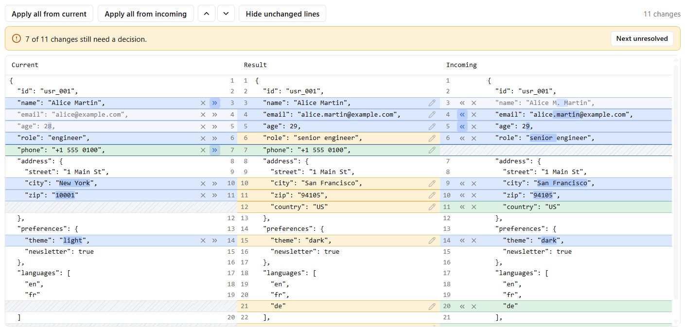
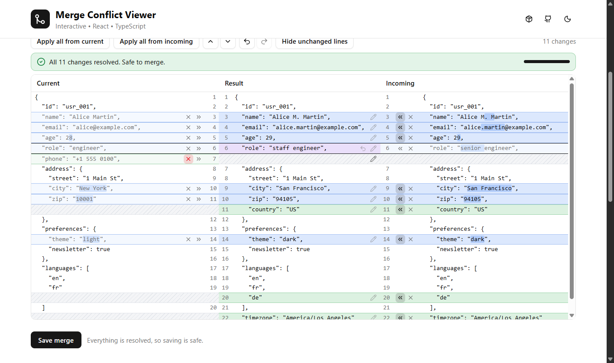

# merge-conflict-viewer

Let users resolve the differences between two JSON documents in a React app, and tell you when the result is safe to save.



[Live demo](https://ht-rnd.github.io/merge-conflict-viewer/): try the component, switch its colours and corners, and open the playground.

You give it a **current** and an **incoming** document. It shows them side by side with a live **result** in the middle (the layout you know from IntelliJ's merge tool). For every difference the user accepts the current value, accepts the incoming value, removes it, or types their own. You get the merged document, and a status that says whether every difference has been decided.

It ships in two parts:

| Part | What it is | How you get it |
|---|---|---|
| **`@ht-rnd/merge-conflict-viewer`** | The headless core: merge logic, a `useMergeViewer` hook and prop getters. No CSS, no components, React is the only peer dependency. | `npm install`, or automatically through the shadcn command below |
| **`merge-conflict-viewer` shadcn component** | Copy-paste UI built on the hook with your shadcn/ui and Tailwind setup. It lands in **your** source tree, so it uses your theme, your fonts and your `Button`, and you can edit anything. | `npx shadcn add <url>` |

- Compares **by structure, not by line**: keys and array items are matched, so a key that only exists on one side gets blank space opposite it instead of being lined up with an unrelated key.
- **"All changes resolved"** is a first-class state: a banner, a `status` object and a `Next unresolved` button.
- **Editable result** (opt in), **undo and redo**, **folded unchanged lines**, previous/next change navigation, stacked layout on narrow screens, light and dark.
- Works with **Tailwind v3.4 and v4** and with React 18 and 19.

## Is this the right tool?

Use it when you have two versions of a JSON document (a saved config and an incoming change, two drafts, local and remote) and a person has to decide what the final document looks like.

It is a **two-way** comparison. There is no common ancestor ("base"), so it never merges anything automatically and does not tell "changed on one side" apart from "changed on both". Every difference is presented for a decision, and the default is the incoming value. The root of each document must be a JSON object.

## Install

In a project that already uses shadcn/ui (`components.json` exists):

```bash
npx shadcn add ht-rnd/merge-conflict-viewer/merge-conflict-viewer
```

This reads `registry.json` from the repository root (a [GitHub registry](https://ui.shadcn.com/docs/registry/github)), so it needs no server. Pin a release with a ref, for example `...merge-conflict-viewer#v1.0.0`, and preview with `--dry-run` or `--diff`. The same registry is also served as static JSON from the demo site, which works with older CLI versions:

```bash
npx shadcn add https://ht-rnd.github.io/merge-conflict-viewer/r/merge-conflict-viewer.json
```

The command:

- installs `@ht-rnd/merge-conflict-viewer` and `lucide-react`,
- adds the shadcn `button`, `textarea`, `progress` and `tooltip` components (and `lib/utils.ts`) when you do not have them yet,
- writes `components/ui/merge-conflict-viewer.tsx`,
- adds the `--merge-*` colour variables (light and dark) to your CSS file.

Prefer a short name? Register the Pages URL as a namespace in your `components.json` and use `npx shadcn add @ht-rnd/merge-conflict-viewer`:

```json
{
  "registries": {
    "@ht-rnd": "https://ht-rnd.github.io/merge-conflict-viewer/r/{name}.json"
  }
}
```

No shadcn? See [Without shadcn](#without-shadcn-headless-only).

## Quick start

```tsx
import { useState } from "react"
import { Button } from "@/components/ui/button"
import { MergeConflictViewer } from "@/components/ui/merge-conflict-viewer"
import { useMergeViewer } from "@ht-rnd/merge-conflict-viewer"

export function ResolveConfig({ current, incoming, onSave }) {
  const viewer = useMergeViewer({ currentJson: current, incomingJson: incoming })

  return (
    <>
      <MergeConflictViewer viewer={viewer} className="h-[600px]" />
      <Button
        disabled={!viewer.status.allResolved}
        onClick={() => onSave(viewer.merged)}
      >
        Save
      </Button>
    </>
  )
}
```

If you do not need to read the state yourself, pass the options straight to the component and it owns the hook:

```tsx
<MergeConflictViewer
  currentJson={current}
  incomingJson={incoming}
  onMergeChange={(merged, status) => setDraft(status.allResolved ? merged : null)}
  className="h-[600px]"
/>
```

Give the viewer a height (`h-[600px]`, `h-full` inside a sized parent, `max-h-[80vh]`). The panes scroll inside it and the column headers stay in view. Without a height it grows with its content and nothing scrolls.

## How it works from the user's side

Every difference is a **change**: a value that differs, a key or array item that exists on one side only, or a type change. Each change is resolved on its own:

| Control | Effect |
|---|---|
| `»` next to Current | Use the current value |
| `«` next to Incoming | Use the incoming value |
| `×` | Remove the key or item from the result |
| pencil in Result (with `editable`) | Write a JSON value yourself |
| `Apply all from current / incoming` | Resolve every change from one side |
| Undo / Redo (`Ctrl/Cmd+Z`, `Ctrl+Shift+Z`) | Step back and forward through decisions, up to 100 steps |

A change starts **unresolved**: the Result pane shows the incoming value on an amber background, and neither side is highlighted as accepted. (An unresolved change that only exists in current is absent from the result, because incoming does not have it.) Once the user decides, the change turns into a normal blue (modified) or green (one side only) block, the side that was not chosen fades, and the banner (with a progress bar) counts down. When nothing is left:



## The component

`components/ui/merge-conflict-viewer.tsx` exports a root and its parts:

| Export | What it renders |
|---|---|
| `MergeConflictViewer` | The root. Takes either `viewer` (from `useMergeViewer`) or the hook options. With no children it renders the toolbar, the banner and the panes. Accepts the props of a `div`. |
| `MergeConflictToolbar` | Apply all, previous/next change, undo/redo, fold toggle, summary. Accepts `children` to add your own buttons. |
| `MergeConflictStatus` | The banner with the progress bar and `Next unresolved`. |
| `MergeConflictPanes` | The three scrolling panes (or the stacked layout). |
| `MergeConflictValueEditor` | The popover editor used by the pencil button. |

Arrange the parts yourself by passing children. Here the banner sits above the panes and there is no toolbar:

```tsx
<MergeConflictViewer currentJson={a} incomingJson={b} className="h-96">
  <MergeConflictStatus />
  <MergeConflictPanes />
</MergeConflictViewer>
```

The parts read the viewer from context, so they work anywhere inside the root. The file is yours: change the markup, swap an icon, restyle a cell.

### Options

These are the options of `useMergeViewer`, also accepted as props by `MergeConflictViewer`.

| Option | Type | Default | Description |
|---|---|---|---|
| `currentJson` | `JsonObject` | required | The left document |
| `incomingJson` | `JsonObject` | required | The right document |
| `onMergeChange` | `(merged: JsonObject, status: MergeStatus) => void` | | Called on mount and when the result or status changes |
| `initialMergedJson` | `JsonObject` | | An existing result; each change starts on the side it matches |
| `startUnresolved` | `boolean` | `true` unless `initialMergedJson` is given | Whether changes start undecided |
| `decisions` | `Selection` | | Controlled decisions (see below) |
| `onDecisionsChange` | `(decisions: Selection) => void` | | Called with the full decisions after every change |
| `editable` | `boolean` | `false` | Let users type values in the Result pane |
| `layout` | `"horizontal" \| "vertical" \| "responsive"` | `"responsive"` | Side by side, stacked, or stacked below `stackBelow` |
| `stackBelow` | `number` | `900` | Container width (px) below which `"responsive"` stacks |
| `collapseUnchanged` | `boolean \| number` | `false` | Fold unchanged runs; a number sets the context lines (default 3) |
| `labels` | `MergeViewerLabels` | English | Every text in the UI, see [Labels](#labels) |

`layout="vertical"` stacks the panes as Current, Incoming, Result.

## Theming

The component is styled with your shadcn tokens (`bg-background`, `text-muted-foreground`, `border`, `ring`, `primary`, ...), so it follows your theme, light and dark, without any setup. Colours that shadcn has no token for (the blue, green, amber and violet change highlights) are CSS variables the install command adds to your stylesheet, in `:root` and `.dark`:

```css
:root {
  --merge-modified: #dce8fd;
  --merge-modified-border: #a4c0f2;
  --merge-modified-highlight: #b3cdfa;
  /* ... */
}
.dark {
  --merge-modified: #25344f;
  /* ... */
}
```

| Variable group | What it colors |
|---|---|
| `--merge-modified`, `-border`, `-highlight` | A value that differs: the block, its border, the changed characters |
| `--merge-added`, `-border`, `-highlight` | A key or item that exists on one side only |
| `--merge-pending`, `-border`, `-highlight` | A result that has not been decided |
| `--merge-edited`, `-border`, `-highlight` | A result typed by hand |
| `--merge-filler`, `--merge-filler-stripe` | The hatched space opposite a missing key |
| `--merge-success`, `-border`, `-icon`, `--merge-warning-icon` | The banner |

### Changing the colours

There are three ways, from least to most invasive. Use whichever fits.

**1. In your stylesheet (everywhere).** Edit the variables the install command added to your CSS, in `:root` for light and in `.dark` for dark mode:

```css
:root {
  --merge-modified: #e0f2fe;
  --merge-added: #dcfce7;
}
.dark {
  --merge-modified: #0c4a6e;
}
```

**2. On one viewer.** Set the variables on the viewer or any ancestor. Add a `dark:` version if the colour should also change in dark mode:

```tsx
<MergeConflictViewer
  className="[--merge-modified:#fde2e4] [--merge-modified-border:#f4a3ad] dark:[--merge-modified:#4a2128]"
  ...
/>
```

**3. In the source.** The component is your code, so you can edit it directly (`components/ui/merge-conflict-viewer.tsx`):

- `MERGE_DEFAULTS` at the top holds the built-in light and dark colour for every variable. Edit a hex value to change what is used when your CSS does not define the variable.
- `TINTS` decides which variable colours which kind of cell, and `STATUS_STYLES` does the same for the banner. Point an entry at a shadcn token instead (for example `bg-muted`), or remove the highlight you don't want.
- Everything else (spacing, text size, icons, the toolbar buttons) is plain Tailwind classes in the same file.

The variables are optional. If your CSS does not define one (you copied the file by hand, or deleted them), the component falls back to the defaults in `MERGE_DEFAULTS`, so it is never uncoloured. Anything you define wins over the default. If you rename or add a colour in the source, define it in `MERGE_DEFAULTS` too.

**Dark mode** is whatever your app uses for shadcn (the `dark` class on an ancestor). **Fonts** are not set by the component: the viewer inherits your `font-sans` and uses `font-mono` for the code panes, so Geist or any other font you configured is picked up. Since the file is in your repo, you can also change the text size (`text-[13px]`) or colours directly.

### Tailwind v3.4 and v4

The same file works with both. It only uses utilities that exist in both (typed arbitrary values such as `bg-[color:var(--mcv-modified)]`, `size-*`, no v4-only syntax) and computes the colour classes per cell in JavaScript, so there are no variant-order surprises. The registry test installs the component into a fresh Tailwind v3.4 project and a fresh v4 project, type-checks them and builds the CSS.

Tailwind v3 projects keep their theme in `tailwind.config.js`; the `--merge-*` variables are plain CSS variables referenced through arbitrary values, so nothing needs to be added to the config.

## Recipes

### Only allow saving when everything is decided

`status.allResolved` is also `true` when the two documents have no differences.

```tsx
const viewer = useMergeViewer({ currentJson, incomingJson })
// ...
<Button disabled={!viewer.status.allResolved} onClick={() => save(viewer.merged)} />
```

Or, without owning the hook, with a callback:

```tsx
onMergeChange={(merged, status) => {
  setDraft(merged)
  setCanSave(status.allResolved)
}}
```

```ts
interface MergeStatus {
  total: number        // changes between the two documents
  resolved: number     // changes someone has decided (side, removal or edit)
  unresolved: number
  edited: number       // resolved changes whose value was typed by hand
  allResolved: boolean // nothing left to decide: safe to merge
}
```

`onMergeChange` runs once on mount (with the starting result), then whenever the result or the status changes. In React strict mode development builds the mount call happens twice, so keep the handler idempotent.

### Drive it from your own buttons

The hook returns everything the toolbar uses:

```tsx
viewer.merged                  // the merged JsonObject (read-only: clone it before changing it)
viewer.status
viewer.applyAll("left" | "right")
viewer.reset()                 // back to the starting state (can be undone)
viewer.undo()
viewer.redo()
viewer.goToNextUnresolved()    // scrolls there, returns false when none is left
viewer.goToChange("next" | "previous")
viewer.choose(change.id, "left" | "right" | "deleted" | { custom: value })
```

### Save a half-finished merge and resume it

Own the state with `decisions` and `onDecisionsChange`. `decisions` only contains the changes that have been decided: each value is `"left"`, `"right"`, `"deleted"` or `{ custom: value }`. Changes without an entry are unresolved.

```tsx
import type { Selection } from "@ht-rnd/merge-conflict-viewer"

const [decisions, setDecisions] = useState<Selection>(() => loadDraft() ?? {})

<MergeConflictViewer
  currentJson={current}
  incomingJson={incoming}
  decisions={decisions}
  onDecisionsChange={(next) => {
    setDecisions(next)
    saveDraft(next)
  }}
/>
```

Change ids are the JSON path of the change (for example `["address","city"]` or `["steps",2]`), so a saved draft stays valid as long as the two documents stay the same. If either document changes, the viewer starts over (see below).

If you only have a previous *result* rather than decisions, pass it as `initialMergedJson`. Each change starts on the side it matches, a value that matches neither becomes an edited value, and the changes count as already resolved (override with `startUnresolved`).

### Let users edit values

```tsx
<MergeConflictViewer editable currentJson={a} incomingJson={b} />
```

Each change in the Result pane gets a pencil. It opens a small JSON editor for that change's value: `Ctrl/Cmd + Enter` applies, `Esc` cancels, and invalid JSON is rejected with the parser's message. Edited values are shown in violet, count as resolved and as `edited` in the status, and have an undo button. Editing is per change, which keeps the three panes aligned and each one valid JSON. It is off by default.

### Large documents

Every line is rendered (there is no virtualization), so for big documents fold the parts that did not change:

```tsx
<MergeConflictViewer collapseUnchanged={3} ... />   // true = 3 lines of context
```

Long unchanged runs collapse into a `⋯ 120 unchanged lines` row that expands on click. Users can toggle it from the toolbar.

### Labels

Every text goes through one `labels` option. Set what you need; the rest keeps its English default. Functions receive what they need to build the sentence.

```tsx
<MergeConflictViewer
  labels={{
    current: "Aktuell",
    result: "Ergebnis",
    incoming: "Eingehend",
    applyAllCurrent: "Alle aktuellen übernehmen",
    unresolved: ({ unresolved }) => `${unresolved} Änderungen offen`,
    allResolved: () => "Alles entschieden. Zusammenführen ist sicher.",
    acceptCurrent: (change) => `Aktuell übernehmen: ${change}`,
  }}
  ...
/>
```

| Key | Default |
|---|---|
| `current`, `result`, `incoming` | `Current`, `Result`, `Incoming` |
| `applyAllCurrent`, `applyAllIncoming` | `Apply all from current`, `Apply all from incoming` |
| `previousChange`, `nextChange`, `undo`, `redo` | `Previous change`, `Next change`, `Undo`, `Redo` |
| `hideUnchanged` | `Hide unchanged lines` |
| `summary(status)` | `11 changes` / `No differences` |
| `noChanges` | `No differences. Nothing to merge.` |
| `unresolved(status)` | `3 of 11 changes still need a decision.` |
| `allResolved(status)` | `All 11 changes resolved. Safe to merge.` |
| `nextUnresolved` | `Next unresolved` |
| `unchangedLines(count)`, `showUnchanged(count)` | `120 unchanged lines`, `Show 120 unchanged lines` |
| `acceptCurrent(change)`, `acceptIncoming(change)` | `Accept current address.city`, `Accept incoming address.city` |
| `removeChange(change)`, `editChange(change)`, `revertEdit(change)` | `Remove address.city from result`, ... |
| `editorTitle(change)`, `editorInput(change)`, `apply`, `cancel` | the value editor |

### Start over when the inputs change

The viewer resets its decisions whenever the *content* of `currentJson` or `incomingJson` changes (they are compared by value, so passing a new object with the same content does nothing). It does not reset when `initialMergedJson`, `startUnresolved` or the controlled `decisions` change. To force a fresh start, give it a `key`:

```tsx
<MergeConflictViewer key={documentId} ... />
```

### Run the merge without any UI

The functions work anywhere, including Node:

```ts
import {
  buildMergeTree,
  buildMergedJson,
  getMergeStatus,
  selectAll,
} from "@ht-rnd/merge-conflict-viewer"

const tree = buildMergeTree(current, incoming)
const decisions = selectAll(tree, "right")

buildMergedJson(tree, decisions) // equals `incoming`
getMergeStatus(tree, decisions)  // { total, resolved, unresolved, edited, allResolved }
```

`useMergeConflicts` is the state-only hook (no layout, no rows) if you only want the changes list:

```tsx
const { tree, merged, status, choose } = useMergeConflicts({ currentJson, incomingJson })

tree.conflicts.map((change) => (
  <li key={change.id}>
    {change.label} ({change.kind})
    <button onClick={() => choose(change.id, "left")}>Mine</button>
    <button onClick={() => choose(change.id, "right")}>Theirs</button>
  </li>
))
```

## Without shadcn (headless only)

`useMergeViewer` returns a render model (`items`) and prop getters. It sets data attributes (`data-pane`, `data-column`, `data-state`, `data-kind`, `data-block-start`, `data-block-end`, `data-active`) and the grid placement as inline style, and you bring the markup and CSS:

```bash
npm install @ht-rnd/merge-conflict-viewer
```

```tsx
import { useMergeViewer } from "@ht-rnd/merge-conflict-viewer"

function Viewer({ current, incoming }) {
  const viewer = useMergeViewer({ currentJson: current, incomingJson: incoming })
  const { ref: scrollRef } = viewer.getScrollProps()

  return (
    <div {...viewer.getRootProps()}>
      <p role="status">{viewer.statusText}</p>

      <div ref={scrollRef} style={{ overflow: "auto", height: 500 }}>
        <div {...viewer.getGridProps()}>
          {(["current", "result", "incoming"] as const).map((pane) => (
            <div key={pane} {...viewer.getHeaderProps(pane)}>
              {viewer.labels[pane]}
            </div>
          ))}

          {viewer.items.map((item) =>
            item.type === "fold" ? (
              <button key={item.key} {...viewer.getFoldProps(item, "current")}>
                {item.label}
              </button>
            ) : (
              (["current", "result", "incoming"] as const).map((pane) => {
                const line = item[pane]
                return (
                  <div key={`${item.key}-${pane}`} {...viewer.getCellProps(item, pane, "code")}>
                    {line.text}
                  </div>
                )
              })
            ),
          )}
        </div>
      </div>
    </div>
  )
}
```

Style it with the data attributes:

```css
[data-state="changed"][data-kind="modified"] { background: #dce8fd; }
[data-state="pending"] { background: #fdf1d6; }
[data-state="rejected"] { opacity: 0.5; }
[data-state="filler"] { background: repeating-linear-gradient(45deg, #f4f5f7 0 4px, #e2e5ea 4px 8px); }
```

For per-change buttons, read `line.actions` (`accept`, `remove`, `edit`, `revert`: each `{ label, pressed, run }`) and render the `number` and `actions` columns with `getCellProps(item, pane, "number" | "actions")`. The shadcn component in `demo/src/components/ui/merge-conflict-viewer.tsx` is a complete reference implementation.

## API

### `useMergeViewer(options)`

Takes the [options](#options) above. Returns everything `useMergeConflicts` returns, plus:

| Returns | Description |
|---|---|
| `items` | Everything shown, in order: rows (`current`, `result` and `incoming` lines) and folds of unchanged lines |
| `labels`, `stacked`, `statusState`, `statusText` | Resolved texts, whether the panes are stacked, and the banner state (`"empty" \| "pending" \| "resolved"`) |
| `collapsed`, `toggleCollapsed` | Whether unchanged runs are folded |
| `activeId`, `goToChange(dir)`, `goToNextUnresolved()` | Navigation between changes |
| `editable`, `editingId`, `startEdit(id)`, `cancelEdit()`, `editorText(id)`, `commitEdit(id, text)` | Editing; `commitEdit` returns the parser's message when the text is not valid JSON |
| `getRootProps()`, `getScrollProps()`, `getGridProps()`, `getHeaderProps(pane)`, `getCellProps(row, pane, column)`, `getFoldProps(fold, pane)` | Prop getters to spread on your elements |

`MergeViewerProvider` and `useMergeViewerContext` let parts share one viewer without prop drilling (this is how the shadcn component's parts work).

### `useMergeConflicts(options)`

Options: `currentJson`, `incomingJson`, `initialMergedJson`, `startUnresolved`, `decisions`, `onDecisionsChange` (same meaning as above).

| Returns | Description |
|---|---|
| `tree` | The comparison. `tree.conflicts` is the ordered list of changes: `{ id, label, kind, path, hasLeft, hasRight, left, right }` where `kind` is `"modified"`, `"left-only"` or `"right-only"` and `label` reads like `endpoints[0].scopes[1]` |
| `merged` | The merged document |
| `status` | `MergeStatus` |
| `decisions` | Explicit decisions only (what to persist) |
| `selection` | What the result holds per change, including the defaults of undecided changes |
| `isResolved(id)` | Whether a change has been decided |
| `choose(id, choice)` | `choice` is `"left"`, `"right"`, `"deleted"` or `{ custom: value }` |
| `revert(id)` | Undo one decision, back to how it started |
| `applyAll(side)` | Resolve every change from `"left"` or `"right"` |
| `reset()` | Back to the starting state (can be undone) |
| `undo()`, `redo()`, `canUndo`, `canRedo` | Step through your decisions (up to 100); no-op decisions are not recorded |

Choosing a side that does not have the key (for example `"left"` for a key that only incoming has) removes it from the result.

### Functions and types

```ts
// Functions
buildMergeTree(current, incoming)      // MergeTree
buildMergedJson(tree, selection)       // JsonObject
getMergeStatus(tree, decisions)        // MergeStatus
selectAll(tree, "left" | "right")      // Selection with every change set to one side
initialSelection(tree, initialMerged?) // how changes start for a given initial result
buildMergeLayout(tree, selection)      // aligned rows for the three panes
foldRows(rows, context, expanded)      // folds unchanged runs of those rows
placeCell(...), gridTemplateColumns(layout)  // grid placement used by the prop getters
splitInlineEdit(...), inlineSegments(...)    // character-level highlighting
defaultLabels, resolveLabels(labels)
deepEqual(a, b)
isCustomChoice(choice)

// Types
JsonObject, DiffSide, SideSelection, Choice, CustomChoice, Selection, MergeStatus,
MergeTree, ConflictEntry, ConflictKind, MergeLayout, MergeRow, MergeBlock,
ResolvedChoice, DisplayItem, MergeViewer, MergeViewerLine, MergeViewerRow,
MergeViewerFold, MergeViewerItem, MergeViewerAction, MergeViewerLabels,
MergeViewerLayout, MergeCellState, UseMergeViewerOptions, MergeConflictsState,
UseMergeConflictsOptions
```

## How documents are compared

1. **Objects** are compared key by key, recursively. Keys are listed in the incoming document's order; keys that only exist in current are placed after their closest preceding neighbour.
2. **Arrays** keep each pane's own order. Items are matched with a longest-common-subsequence alignment:
   - by an identity field when every item of both arrays is an object with a unique `id`, `@id`, `key`, `name`, `code`, `uuid` or `slug` (first one that qualifies), so an edited object shows its changed fields instead of "removed + added";
   - otherwise by exact equality (key order inside objects does not matter);
   - items left between two matches are paired by position and compared recursively, and any remainder is a removal or an addition.
3. **Type changes** (string to number, array to object, `null` to a value) are one change.
4. **A moved array item** shows as removed in one place and added in the other.
5. Each change is a block as tall as its longer side, padded with hatched filler, so the panes always line up row for row. Commas are computed per pane, so each pane is valid JSON.

The input documents are never modified.

## Testing your integration

The root element carries `data-merge-status="pending" | "resolved" | "empty"`, and every button has an accessible name (see [Labels](#labels)), so tests can use `getByLabelText("Accept current address.city")` and `getByRole("status")`. The viewer renders in jsdom; `ResizeObserver` is optional (the responsive layout simply stays horizontal when it is missing).

## Good to know

- **Accessibility.** All controls are real buttons with labels such as `Accept incoming address.city`, the banner is a live region, and the editor works from the keyboard. Line-number gutters are hidden from assistive technology.
- **Browsers.** Evergreen browsers from 2023 on (the component uses CSS `color-mix()`).
- **Size.** The npm package has no runtime dependencies and ships no CSS. The component adds `lucide-react` and the shadcn parts you probably already have.
- **Not included.** Three-way merge with a base, automatic merging, merging non-object roots, and virtualized rendering.

## Development

```bash
npm install
npm --prefix demo install
npm run test            # headless package tests (vitest)
npm run test:demo       # registry component tests (vitest + jsdom)
npm run check           # lint and format with Biome, writing fixes
npm run build           # lint, then build the package into dist/
npm run test:package    # pack the tarball and use it as a consumer would
npm run registry:build  # build demo/public/r/*.json from registry.json
npm run test:registry   # install the component into fresh Tailwind v3.4 and v4 projects (slow, needs network)
```

The demo app lives in `demo/` (Vite, Tailwind v4, shadcn/ui). It is the source of truth for the registry component (`demo/src/components/ui/merge-conflict-viewer.tsx`) and is deployed to GitHub Pages together with the registry files in `/r`:

```bash
npm run dev
```

CI runs all of the above on every pull request. On `main`, a new version in `package.json` is published to npm (with provenance) and tagged as a GitHub release. When you change the package API, bump the version and keep the `@ht-rnd/merge-conflict-viewer@^x.y.z` range in `registry.json` in step (`registry:build` fails when they disagree).

## License

Apache-2.0
